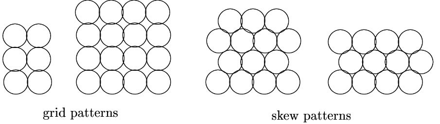
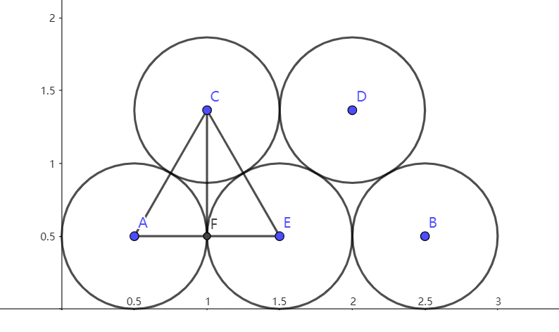

## 题目

Filters, or programs that pass "processed" data through in some changed form, are an important class of programs in the UNIX operating system. A pipe is an operating system concept that permits data to "flow"”" between processes (and allows filters to be chained together easily.)

This problem involves maximizing the number of pipes that can be fit into a storage container (but it’s a pipe fitting problem, not a bin packing problem).

A company manufactures pipes of uniform diameter. All pipes are stored in rectangular storage containers, but the containers come in several different sizes. Pipes are stored in rows within a container so that there is no space between pipes in any row (there may be some space at the end of a row), i.e.,all pipes in a row are tangent, or touch. Within a rectangular cross-section, pipes are stored in either a grid pattern or a skew pattern as shown below: the two left-most cross-sections are in a grid pattern,the two right-most cross-sections are in a skew pattern.

<!--  -->

Note that although it may not be apparent from the diagram, there is no space between adjacent pipes in any row. The pipes in any row are tangent to (touch) the pipes in the row below (or rest on the bottom of the container). When pipes are packed into a container, there may be “left-over” space in which a pipe cannot be packed. Such left-over space is packed with padding so that the pipes cannot settle during shipping.

### Input

The input is a sequence of cross-section dimensions of storage containers. Each cross-section is given as two real values on one line separated by white space. The dimensions are expressed in units of pipe diameters. All dimensions will be less than $2^7$. Note that a cross section with dimensions $a\times b$ can also be viewed as a cross section with dimensions $b \times a$.

### Output

For each cross-section in the input, your program should print the maximum number of pipes that can be packed into that cross section. The number of pipes is an integer — no fractional pipes can be packed. The maximum number is followed by the word ‘grid’ if a grid pattern results in the maximal number of pipes or the word ‘skew’ if a skew pattern results in the maximal number of pipes. If the pattern doesn’t matter, that is the same number of pipes can be packed with either a grid or skew pattern, then the word ‘grid’ should be printed.

### Sample Input

3 3
2.9 10
2.9 10.5
11 11

### Sample Output

9 grid
29 skew
30 skew
126 skew

### 题意

给定一个container(本质上是一个长方形)，要将单位长度的圆放入长方形内，问最多能放多少个圆。注意有几个限制：

1. 圆是一排一排放的，也就是先放在长方形的最底部，直到第一排放不下了，再接着在圆上放第二排。
2. 每一排的圆都是挨着的，也就是相切，这也意味着第一排的摆放方式是固定的。从第二排开始，每一排不仅相邻的圆是相切的，还与上一排的圆相切，意味着总共有两种摆放方式：grid和skew，见题目上的图。

## 思路

先定义长方形两边分别为a和b,从圆的摆放方式和长方形的摆放我们共有4种摆放方式：

1. a为底b为边，采用grid的方式摆放；
2. a为底b为边，采用skew的方式摆放；
3. b为底a为边，采用grid的方式摆放；
4. b为底a为边，采用skew的方式摆放。

在grid形式的摆放方式中，1和3没有区别，能摆放的圆的个数是一样的，所以我们共有三种情况需要计算，分别计算三种情况下能摆放的圆的个数并取最大值即可得出结果。

1. 计算grid能摆放的圆的个数，圆是单位圆，所以长和宽a,b的向下取整表示了每一行能放置多少个圆和一共能够放置多少行，则$num=\lfloor a \rfloor \times \lfloor b \rfloor$.
2. skew方式计算，先看这种方式下圆的摆放：

<!--  -->
由于每一排相邻的圆相切，下一排(从下往上第二排)与上一排(从下往上第一排)的圆也相切，所以AE=AC=CE,三角形ACE是等边三角形，且边长为1，CF垂直于AE，根据等边三角形高的计算公式，CF长度为$\frac{ \sqrt{3} }{2}$.所以摆放两排圆的高度为$H_2=0.5+0.5+Len(CF)$,其中Len(CF)=$\frac{ \sqrt{3} }{2}$.推广到摆放n排，则摆放高度为：
   $$ H_n = 0.5+0.5+n*Len(CF) $$
由于摆放高度受限于长方形的边x,我们可以得到不等式：
$$ 0.5+0.5+n*Len(CF)<=x $$
 =>
$$ n<=\frac{x-1}{Len(CF)} $$
 =>
$$ n=\lfloor \frac{x-1}{Len(CF)} \rfloor $$
边为x的情况下最多能摆n+1排圆。

skew模式下摆放时，一排一排是交错摆放的，所以相邻的两派能摆放的数量可能不一致，通过上图也可以看出第二排是从0.5的位置开始摆放，通过起始位置和底长，很容易算出第二排能摆放多少个圆。

### 问题

#### 实现上的问题

#### 性能上的问题

## 实现

```JAVA {.line-numbers}
//file
import java.util.Scanner;

public class Main {
    public static void main(String[] args) {
        Scanner scanner = new Scanner(System.in);
        while (scanner.hasNextLine()) {
            String line = scanner.nextLine();
            String[] numstrs = line.split(" ");
            double row = Double.valueOf(numstrs[0]);
            double col = Double.valueOf(numstrs[1]);

            //calculate four cases:row-col-grid,row-col-skew,col-row-grid,col-row-skew
            int intRow = Double.valueOf(Math.floor(row)).intValue();
            int intCol = Double.valueOf(Math.floor(col)).intValue();
            //case: 网格方式摆放只需要算出底和边的整数长度即可
            int maxGridNumber = intRow * intCol;
            boolean isGrid = true;

            /**
             * case: row-col-skew:skew摆放模式下放置球的个数计算
             */
            double x = (col - 1) * 2 / Math.sqrt(3);
            int intx = Double.valueOf(Math.floor(x)).intValue() + 1;
            if (intx > 0) {
                //计算第二排能摆放的球的个数
                int secondRow = Double.valueOf(row - 0.5).intValue();
                int tempNumber = (intRow + secondRow) * (intx / 2);
                if (intx % 2 != 0) {
                    tempNumber += intRow;
                }
                if (tempNumber > maxGridNumber) {
                    maxGridNumber = tempNumber;
                    isGrid = false;
                }
            }

            /**
             * case: col-row-case:同上只不过长方形转了个方向，能放置的球数会有变化
             */
            double y = (row - 1) * 2 / Math.sqrt(3);
            int inty = Double.valueOf(Math.floor(y)).intValue() + 1;
            if (inty > 0) {
                //calculate the number in first row and second row
                int secondCol = Double.valueOf(col - 0.5).intValue();
                int tempNumber = (intCol + secondCol) * (inty / 2);
                if (inty % 2 != 0) {
                    tempNumber += intCol;
                }
                if (tempNumber > maxGridNumber) {
                    maxGridNumber = tempNumber;
                    isGrid = false;
                }
            }

            String pattern = "";
            if (isGrid) {
                pattern = "grid";
            } else {
                pattern = "skew";
            }
            System.out.printf("%d %s\n", maxGridNumber, pattern);
        }
    }
}
```
